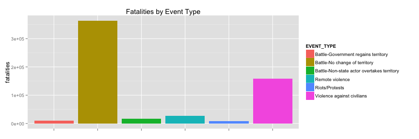

## Where, When, and Why

The years 1997 - 2014 saw approximately 586716 people killed in Africa due to various types of violence.

We'll use data from the Armed Conflict Location & Event Data Project (http://www.acleddata.com/, see below) to get a better understanding of how these fatalities varied across countries, over time, and by cause. 

With ``50`` unique countries, ``18`` years, and ``6`` event types, we'll need an interactive means of interpreting this data as graphs would be exceedingly complex. 

<iframe src='http://www.acleddata.com/' height = '300px'></iframe>

--- .class #id 

## Yearly roll-up
Yearly the trend looks like this for all event types:

 

This chart is interesting, but it's difficult to tell what's driving variations over time. The spike in 1999 to almost 200,000 deaths leaves a lot of questions unanswered. What countries did these deaths occur in? What types of conflict drove this spike? 

---

## Event type roll-up
As was the case with a yearly roll-up, this chart is interesting but we're missing two axes - time and country.

 

We're able to say that 'Battle-No change of territory' accounts for the majority of deaths, but we have no idea if those deaths occurred disproportionately in 1999 or in specific countries. We need an more flexible way to observe how time, type of conflict, and country interact. 

---

## Shiny to the rescue
With a shiny app and choropleth, we can more easily observe how fatalities vary by cause (Event Type), time (Year), and place (Country).(It may take few seconds to load)

Setting the year to 1999 and cycling through the various conflict types gives us a much clearer picture of what happened - it looks like Angola and Eritrea each had around 80,000 deaths due to 'Battle-No change of territory' in 1999. Those two conflict types and countries explain 70% of deaths in 1999. 

<iframe src='http://rworden.shinyapps.io/project' height = '300px'></iframe>
